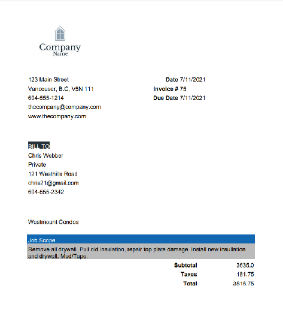

# JobJug

JobJug is a project management web application meant for internal use between employees/managers/ and admin only. There is no ability to sign up for security purposes. All new users are created within the logged in app by existing managers or admin. 

JobJug allows users to log in to their personal profile. From there, all page loads and actions are based on the users auth level, which is checked by their session token at all times. 

JobJug is mobile, tablet, and desktop friendly. 

Tech stack: 

Backend: Python, Flask, MariaDb // [API repo](https://github.com/MarcGravel/JobJugBackendApi)

Frontend (this repo): Javascript, Vue.js, HTML, CSS, and SASS.

## Project setup
```
npm install
```

### Compiles and hot-reloads for development
```
npm run serve
```

### Compiles and minifies for production
```
npm run build
```

### Lints and fixes files
```
npm run lint
```

# Usage at Authorization Level

### Admin Only:
- Create or delete other admins
- Change passwords of any user

### Admin and Managers
- View all jobs existing in database
- Create jobs
- Edit jobs
- Invoice jobs (only completed jobs with valid clients can be invoiced)
- Delete jobs (invoiced jobs cannot be deleted, only archived)
- Add notes to jobs or change jobs status at any time (active, completed, archived)
- Create, edit, or delete employees or managers
- Create, edit, and delete clients
- Assign employees to jobs
- Assign clients to jobs
- View all clients
- View all employees
- View hourly rates of employees
- Change passwords of employees only

### Employees
- View only jobs assigned to them
- Add notes and/or complete jobs assigned to them
- View only clients assigned to jobs that are assigned to them
- View all employees
- Change their own password

# Features
- Sort Jobs by: All, Scheduled Date, Job Status, Client, Job Name
- Filter Jobs by: Active, Complete, Archived
- Search Jobs By Name

- Sort Employees by: All(name), ID, Position
- Filter Employees by: Admin, Manager, Employee
- Search Emplyoees by Name

- Sort Clients by: All(name), ID, Company
- Filter Clients by: Active Clients, Past Clients
- Search Clients by Name

- Automatic invoice PDF building and sending for quick effortless invoicing
- Custom built email sender attaches invoice in .pdf format and sends to client at a click of a button.
- Strong organization between user authorization levels. Ensuring employees are only able to see pertinent information regarding the jobs assigned to them.
- Website is viewable from all screen sizes with UI/UX adjustments at multiple set breakpoints
- Quick navigation of all pages and data without overloading pages with elements.

# Screenshots and display information
All display information will be shown from Manager view

### Login


User login screen.

### Home Page/Schedule View


Upon successful login user will be taken to the schedule page. All users will be shown the schedule based on job creation. The most recent job to be created at the top.

Managers and Admins:
 Will see a complete list of all active and completed jobs. From there they are able to sort, search, or filter through jobs. The archived jobs are stored in a different manner as to not clutter the page or web traffic with old jobs. If a user wants to see archived jobs, they can click the archive filter to view all archived jobs.

Employees:
 Will see a complete list of jobs that are currently assigned to them. They are unable to search or view jobs that are not assigned to them

### Job View


Jobs page will display all relevant information to the job selected. The top tool bar allows the user to search all jobs by name to change the view of the job currently displayed. All jobs have a notes section where any user with access to that job can add notes at anytime. All jobs can be completed by any user with access to that job. Jobs that are completed without a Completed on manually set will have the completed date set automatically. 

Managers and Admin:
 - Have the ability to create new jobs or edit current job using the toolbar.
 - Are able to invoice the jobs. Jobs cannot be invoiced until the job is complete, there is an   invoice total, as well as an assigned client to the job. 
 - Creating jobs requires certain feilds to be complete, but not all fields must be filled.
 - Creating and editing jobs is where users can assign or remove employees and clients to the jobs

Employees:
 - Are only able to view certain job info (unable to see cost, charged, and invoice info)
 - Can only add notes and complete jobs. 

### Employee View


The employees page is viewable by all authorization levels. All users can view, search, sort, and filter through all employees. Managers and Admin are the only ones able to see hourly pay rates. Employees can only see their own pay rate. 

Example of the auto fill search function available for employees, clients, and jobs:


### Clients View


All users can search, sort, and filter through clients on this page.

Managers and Admin: 
 - Can view all clients. They are also able to create new clients and edit existing ones through this page.

Employees: 
 - Can only view clients that are assigned to the same job as them. Employees cannot create or edit clients. 

### Edit and Create views


Each layout slightly differs depending on what object you are creating or editing, but a simple dark overlay is applied to the page when a create or edit is being done. 

### Invoicing

When the job is completed and all required info is submitted, a manager or admin is able to click the invoice button. This will activate a prompt ensuring the user is sure they want to proceed with invoicing. 

Once user proceeds with the alert, a PDF is generated from all job info. That PDF is then attached to a custom email and send directly to the client. 


The email contains the attached invoice in PDF format. 



At any time after the invoice has been sent, a manager or admin can go to the job page and click view invoice to receive a PDF copy of that invoice that will automatically start a download through their browser. 

### Some Mobile Views

Mobile Pop up Menus


Schedule View


Job View


Employee View


Employee Create Overlay view


Changing your password is as simple as clicking your name in the navagation bar


A job view with notes and simple complete button


